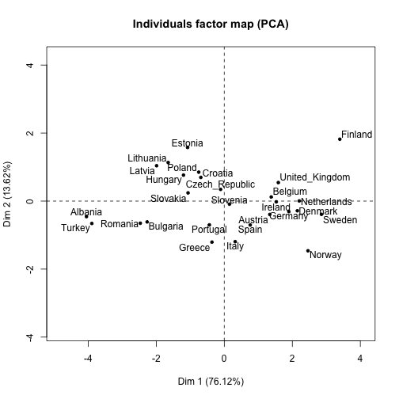
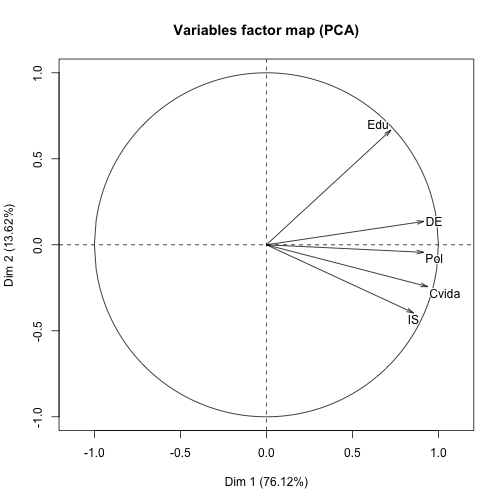

## Alejandro Hernández Farías


Para este ejercicio estoy utilizando una base de datos de 100 paises obtenida de la siguiente liga:

<http://wiki.stat.ucla.edu/socr/index.php/SOCR_Data_2008_World_CountriesRankings> 

Considerando las siguientes variables: Grupo de Ingreso (GpoIngr), Grupo de Población (GpoPob), Región, Dinamismo económico (DE), Educación (Edu), Índice de Salud (IS), Calidad de Vida (CVida) y Ambiente político (Pol):


```r
paises <- read.table("/Users/alex/Documents/Github/PropedeuticoDataScience2017/Alumnos/Alejandro_Hdz/paises.txt")
head(paises)
```

```
##            GpoIngr GpoPob         Region      DE     Edu      IS   Cvida
## Albania       Bajo   Bajo     Sur_Europa 34.0862 81.0164 71.0244 67.9240
## Algeria      Medio  Medio   Africa_Norte 25.8057 74.8027 66.1951 60.9347
## Argentina    Medio  Medio    Sud_America 37.4511 69.8825 78.2683 68.1559
## Australia     Alto  Medio      Australia 71.4888 91.4802 95.1707 90.5729
## Austria       Alto   Bajo Europa_Central 53.9431 90.4578 90.3415 87.5630
## Azerbaijan    Bajo   Bajo   Asia_central 53.6457 68.9880 58.9512 68.9572
##                Pol
## Albania    58.6742
## Algeria    32.6054
## Argentina  68.6647
## Australia  90.9629
## Austria    91.2073
## Azerbaijan 40.0390
```

Para tener una idea de los datos que están de la base:

```r
summary(paises)
```

```
##   GpoIngr     GpoPob              Region         DE       
##  Alto :36   Alto :22   Africa        :14   Min.   :21.66  
##  Bajo :38   Bajo :53   Medio_Oriente :11   1st Qu.:37.45  
##  Medio:26   Medio:25   Norte_Europa  :11   Median :45.49  
##                        Sud_America   :11   Mean   :47.05  
##                        Europa_Central: 9   3rd Qu.:56.80  
##                        Sur_Europa    : 7   Max.   :83.06  
##                        (Other)       :37                  
##       Edu               IS             Cvida            Pol       
##  Min.   : 44.50   Min.   : 13.07   Min.   :26.33   Min.   :25.64  
##  1st Qu.: 73.46   1st Qu.: 61.37   1st Qu.:57.69   1st Qu.:47.13  
##  Median : 80.82   Median : 73.44   Median :68.64   Median :62.43  
##  Mean   : 79.91   Mean   : 69.99   Mean   :67.49   Mean   :62.75  
##  3rd Qu.: 89.47   3rd Qu.: 86.12   3rd Qu.:78.49   3rd Qu.:78.47  
##  Max.   :102.00   Max.   :100.00   Max.   :98.45   Max.   :98.53  
## 
```

Para hacer el análisis de __componentes principales__ vamos a considerar sólo las variables cuantitativas y vamos a acotarlo a los paises de Europa; es decir, las regiones de Europa del Sur, Europa Central y Europa del Norte:


```r
europa<-paises[paises$Region=="Sur_Europa" | paises$Region=="Europa_Central" | paises$Region=="Norte_Europa" ,4:8]
europa
```

```
##                     DE      Edu      IS   Cvida     Pol
## Albania        34.0862  81.0164 71.0244 67.9240 58.6742
## Austria        53.9431  90.4578 90.3415 87.5630 91.2073
## Belgium        60.4988  92.0681 90.3415 85.3846 85.0999
## Bulgaria       43.7178  82.2277 75.8537 73.1197 73.1686
## Croatia        52.9764  90.4578 80.6829 74.4456 75.8574
## Czech_Republic 50.1115  90.9946 85.5122 77.1468 81.6777
## Denmark        65.0819  90.6815 90.3415 90.6586 92.6703
## Estonia        51.2727  93.3205 75.8537 71.4979 73.2333
## Finland        70.4893 102.0000 90.3415 91.4803 92.6740
## Germany        61.8857  91.1288 92.7561 88.7955 89.4962
## Greece         47.4299  85.0904 90.3415 82.2692 77.4610
## Hungary        46.2277  90.2022 75.8537 75.5361 76.3036
## Ireland        55.6233  92.8434 92.7561 86.7869 87.5407
## Italy          48.4651  87.0073 95.1707 84.0172 80.1499
## Latvia         43.8555  89.5633 71.0244 71.6455 73.1686
## Lithuania      49.1361  89.0663 68.6098 72.0818 78.1186
## Netherlands    61.8400  92.6943 92.7561 87.0721 95.7076
## Norway         60.1113  87.1351 92.7561 98.4516 98.2889
## Poland         48.3652  91.0542 78.2683 73.8911 81.7852
## Portugal       48.8681  86.2831 87.9268 78.3798 79.9702
## Romania        43.6252  81.2139 73.4390 72.7583 73.9019
## Slovakia       44.8191  88.4898 78.2683 76.5187 79.8297
## Slovenia       53.8575  89.2651 87.9268 78.4418 82.1666
## Spain          60.6893  87.7741 95.1707 80.0811 80.6999
## Sweden         71.5193  90.7560 95.1707 88.6475 98.5333
## Turkey         39.6282  80.3938 75.8537 66.1416 54.2742
## United_Kingdom 72.9428  92.8434 90.3415 84.7077 75.9222
```

Instalamos la librería FactoMineR `install.packages("FactoMineR")` y la llamamos para hacer el PCA:


```r
library("FactoMineR")
model <- PCA(europa)
```

  

### Conclusiones

En primera instancia podemos ver que con la primer compontente se explica el 76.12% de la variabilidad de los datos.

Con respecto a los paises, podemos apreciar que existen agrupaciones de los mismos que nos son familiares como Lithuania, Estonia, Latvia, Polonia, Republica Checa y Slovaquia. 

Asimismo, existe otro grupo de paises más desarrollados cuya agrupación también nos resulta familiar como Alemania, Holanda, Dinamarca, Suecia, Noruega, Austria y España.

Por otro lado, relativo a las variables vemos que casi no hay relación entre educación e índice de salud, pero sí existe relación entre dinamismo económico y ambiente político, entre ambiente político y calidad de vida y entre calidad de vida e índice de salud.
